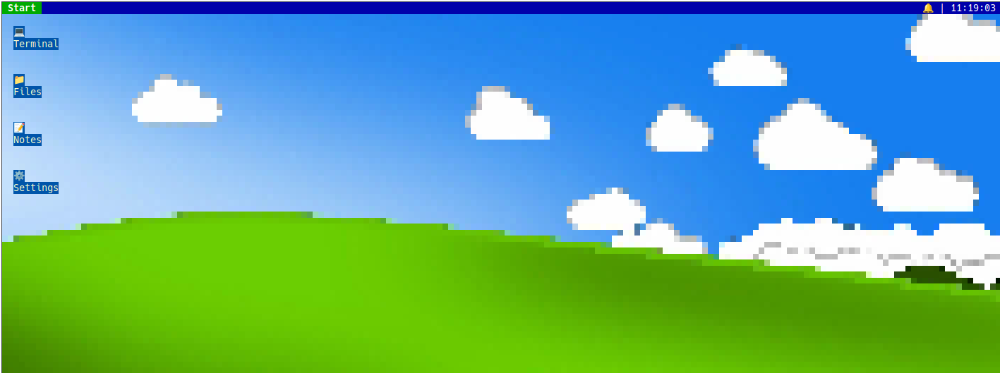
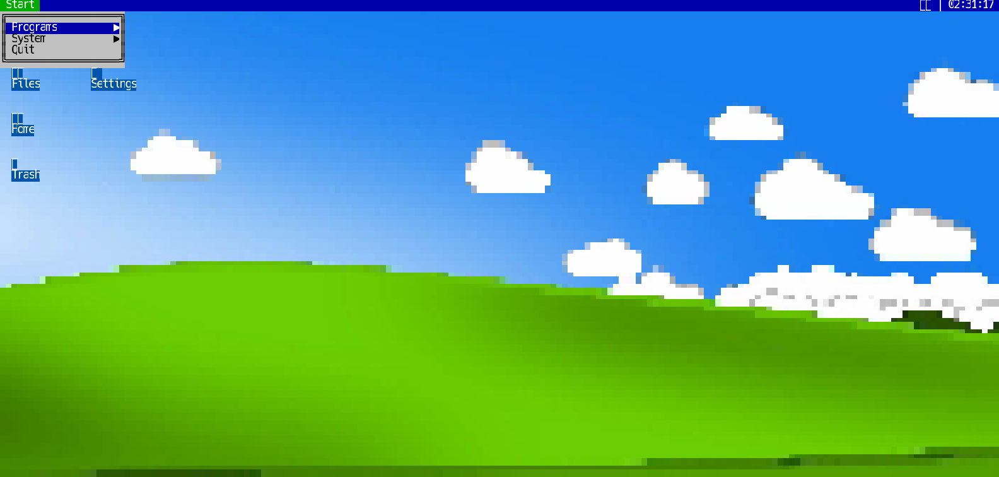
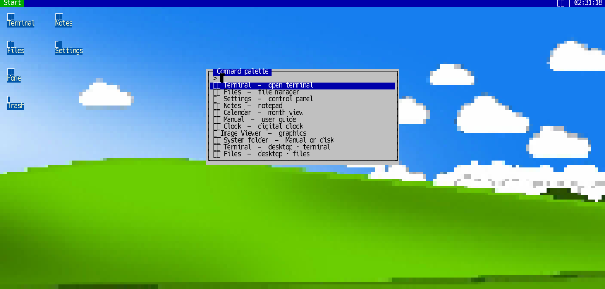
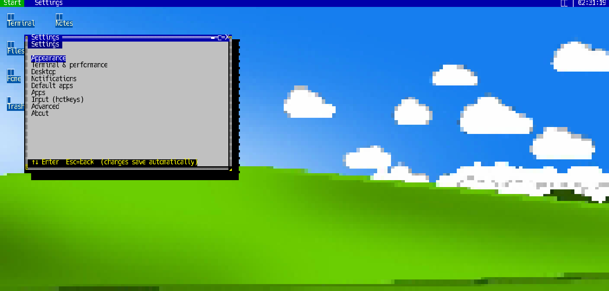
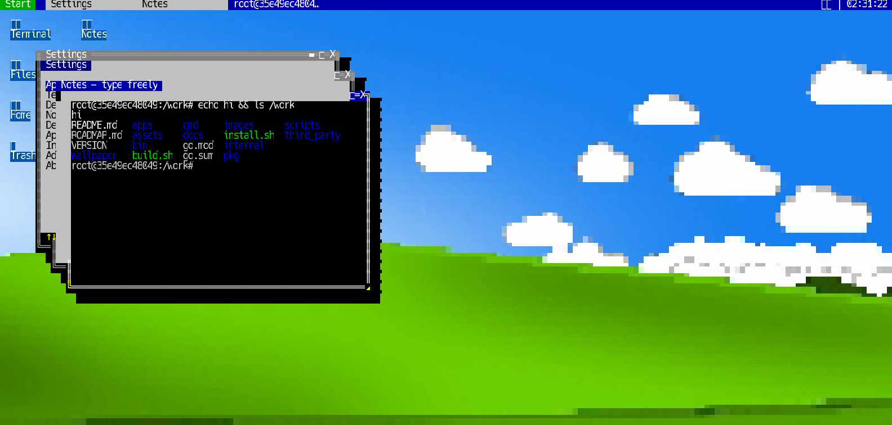
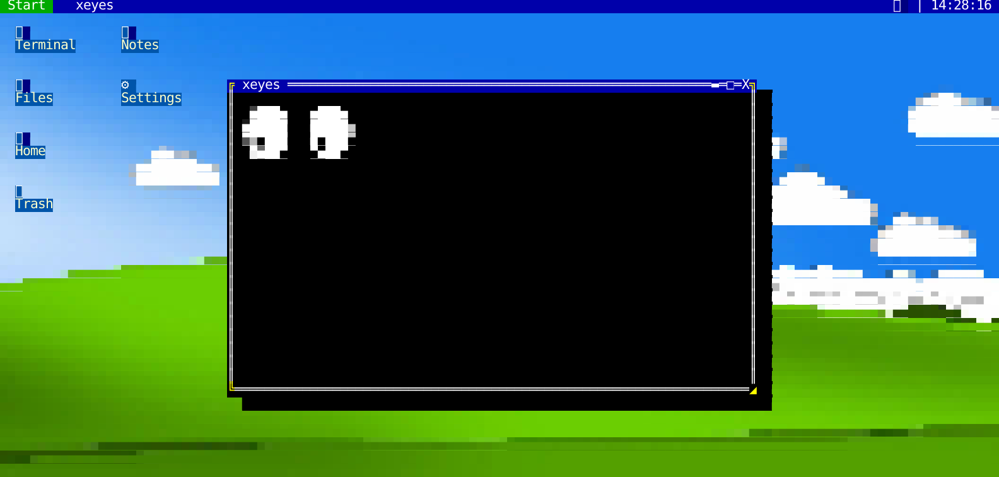

# TTYPE Desk

[](https://github.com/RetroCodeRamen/ttypedesk)
[](LICENSE)

<p align="center">
  
</p>

> **A Windows-9x-shaped desktop, hallucinated entirely out of terminal cells.**

Somewhere around the fourth time I alt-tabbed between six `tmux` panes and thought *"this would be so much nicer with a title bar,"* I decided the correct fix was obviously to build an entire draggable, resizable, taskbar-having window manager — inside the terminal I was already complaining about. This is that. No X11, no Wayland, no compositor. Just cells, glyphs, and a truecolor terminal that has agreed to pretend very hard.

**TTYPE Desk** multiplexes real TUI programs (bash, vim, htop — anything with a PTY) via **libvterm**, hosts native apps through an in-process **App SDK**, bridges in real X11 GUI apps as floating windows, and can render images as truecolor half-block "graphics," because if you're going to commit to the bit, you might as well be able to open a JPEG in it too. Draggable windows, a Start menu, a taskbar, a command palette, a full control panel — everything a desktop needs, none of what it doesn't (a compositor, a display server, or any right to exist).

**Want the deep dive instead of the tour?** → [MANUAL.md](MANUAL.md) covers every subsystem in detail. This README is the highlight reel.

## Quick start

```bash
curl -fsSL https://raw.githubusercontent.com/RetroCodeRamen/ttypedesk/master/install.sh | bash
```

Linux only. Handles build deps, a Go toolchain if yours is too old, cloning,
and building — drops `ttypedesk` in `~/.local/bin`, ready to run. Details,
verification, and the manual-build path: [Install](#install-one-liner) below.

## The tour

Start menu, opened the normal way — hover for flyouts, click to launch:

<p align="center">
  
</p>

The command palette — type instead of navigating, because menus are for people with time to spare:

<p align="center">
  
</p>

A real control panel. Every change applies and saves instantly — there is no Save button to forget to click:

<p align="center">
  
</p>

And yes, it's an actual window manager — drag, stack, focus, resize, three windows deep, real colored terminal output and all:

<p align="center">
  
</p>

And here's the part that really shouldn't work: the **GUI–TUI Bridge** renders real, unmodified X11 apps as windows in the desktop — not a screenshot of one, an actual live `xeyes` process launched and captured in the background, re-encoded frame-by-frame as half-block cells, tracking your mouse in real time:

<p align="center">
  
</p>

`bridge:firefox`, `bridge:gimp`, genuinely any X11 app — see [docs/gui-bridge.md](docs/gui-bridge.md) for how. There's also a folder manager, a Calendar, an App Store, and a notification center. [MANUAL.md](MANUAL.md) has the full tour; keep reading here for the parts you actually need to get it running.

## Requirements

- Go 1.22+
- gcc / ar (to build vendored libvterm — yes, there's C in here; a terminal emulator without a real VT100 parser is just a very confident text box)
- A truecolor-capable host terminal (`COLORTERM=truecolor` recommended — this is a 2026 desktop wearing 1998's clothes, it still wants the good colors)
- **Optional:** `Xvfb` (+ whatever GUI apps you want to bridge in) if you want to use the [GUI–TUI App Bridge](docs/gui-bridge.md) — `bridge:firefox`, `bridge:gimp`, genuinely any X11 app, rendered as half-blocks in a window like everything else. Not needed for anything else in the desktop. Also optional: `dbus-daemon` + `at-spi2-registryd` (`at-spi2-core`), for legible real text instead of colored noise in bridged **native GTK/Qt** apps — doesn't help Electron-based apps (e.g. Cursor/VS Code), see the doc for why.
- **Optional:** `ffmpeg` if you want to use **Amp** (music player) or **Vid** (video player), both in Start ▸ Programs — decoding always shells out to it rather than linking a decoder library. Not needed for anything else.
- **Optional:** `parec` (from `pulseaudio-utils`, or already present via PipeWire's `pipewire-pulse` compat layer on most modern distros) if you want **Settings → Audio streaming** — playing host audio on an attached remote client. Not needed for local use.

libvterm **0.3.3** is vendored under `third_party/libvterm-0.3.3` (no system package required — one less thing to go wrong on someone else's machine).

## Install (one-liner)

```bash
curl -fsSL https://raw.githubusercontent.com/RetroCodeRamen/ttypedesk/master/install.sh | bash
```

Linux only. Installs build deps (`apt`/`dnf`/`pacman`/`zypper`/`apk`, best-effort
outside Debian/Ubuntu, prompting for `sudo` right there in your terminal if it's
needed — nothing is ever stored), bootstraps a per-user Go toolchain if yours is
too old, clones the repo, builds it, and drops `ttypedesk` in `~/.local/bin`.

Verified against clean containers on Ubuntu 24.04, Debian 12, and Fedora
(apt/dnf paths, both root-without-`sudo` and regular-user-with-`sudo`) —
including `ttypedesk -update` running from its own already-executing binary.
Other distros (pacman/zypper/apk) are best-effort and less exercised;
cloning manually and running `./build.sh` (below) is always the fallback.

### Updating

```bash
ttypedesk -update
```

Re-runs the installer above in place: pulls the latest `master`, rebuilds,
and reinstalls to `~/.local/bin/ttypedesk`. Same thing as re-running the
one-liner by hand.

## Build

```bash
./build.sh
# or, if you enjoy typing:
#   (cd third_party/libvterm-0.3.3/build && gcc -std=c99 -O2 -I../include -I../src -c ../src/*.c && ar rcs libvterm.a *.o)
#   go build -o bin/ttypedesk ./cmd/ttypedesk
```

## Run

```bash
./bin/ttypedesk
```

That's it. No installer wizard, no EULA, no "would you like to also install a browser toolbar." Just a desktop, appearing where a desktop has no business appearing.

### Controls

| Input | Action |
|-------|--------|
| Mouse | Focus, drag title bar, resize edges/corners, minimize/maximize/close |
| Desktop icons | Click to launch; drag to reposition (saved to config) |
| Taskbar buttons | Focus or restore minimized windows |
| Drag in content | Text select (or Shift+drag if app has mouse mode) |
| Middle-click / Ctrl+V | Paste clipboard |
| Ctrl+Shift+C | Copy selection (also auto-copies on mouse-up) |
| Wheel | Scrollback |
| Shift+PgUp / Shift+PgDn | Scrollback |
| **F8** | Copy-mode — keyboard scrollback selection (hjkl/arrows, Space/v select, Enter/y copy, Esc cancel) |
| Ctrl+Shift+F | Find in scrollback (often stolen by Guake / host terminals) |
| **F3** / **Alt+/** | Find in scrollback (remappable: Settings → Input) |
| **Ctrl+Space** / **Ctrl+P** | Command palette |
| Alt+Arrows | Move window |
| Alt+Shift+Arrows | Resize window |
| Alt+Ctrl+Arrows | Snap to half desktop (repeat same side to restore) |
| Alt+Tab | Cycle focus |
| **F10** / **Ctrl+Esc** | Start menu (preferred; Alt+Space often stolen by host) |
| Alt+Space / Start button | Start menu (if host allows) |
| Ctrl+W | Close focused window |
| Ctrl+M | Minimize focused window |
| Ctrl+Q | Quit |

Full keybinding rationale, every Settings section, and how each subsystem
actually works: [MANUAL.md](MANUAL.md).

### Start menu

Yes, it's in the corner. Yes, clicking it does what you think. We know exactly what we're doing.

- **Programs ▶** — Notes, Calendar, Clock, Image Viewer, plus user apps with menu=`programs`
- **System ▶** — Terminal, Files, Settings, **Manual**, **System folder**, **Add Program…**, **Manage Programs…**, plus user apps with menu=`system`
- **App Store 🛍** — install extra apps from configured GitHub catalogs (default: [ttypedesk-apps](https://github.com/RetroCodeRamen/ttypedesk-apps)); installed apps register themselves into Programs/System automatically. See [docs/appstore.md](docs/appstore.md)
- **Quit**

**Add Program…** — set **Desk name** (e.g. Task Manager), **Command** (e.g. `htop`), emoji, **Start menu** folder (Programs or System), optional desktop shortcut.

**Manage Programs…** — list custom apps; Delete/Enter to remove (also drops their desktop shortcut).

Mouse: hover opens flyouts; click to launch. Keyboard: ↑↓, →/Enter into submenu, ←/Esc back.

Taskbar tray: **🔔** opens Notification Center; clock opens Calendar.

### Troubleshooting

It's a desktop environment hand-rolled inside a terminal emulator inside (probably) another terminal emulator. Something will eventually go sideways. When it does, it leaves a note instead of just quietly dying — that's the log file:

Log file (panics, deadlocks, app crashes): `~/.config/ttypedesk/ttypedesk.log`  
Override with `TTYPEDESK_LOG=/path/to/file` or `TTYPEDESK_LOG_LEVEL=debug`.

Native app panics are isolated to that window (red crash screen; Esc/Q closes it) instead of taking the whole desktop down with them. The main event/draw loop also recovers and keeps going when possible, because one misbehaving `htop` window is not a reason to lose your other twelve.

More troubleshooting (and more of everything else): [MANUAL.md](MANUAL.md#troubleshooting).

```bash
./bin/ttypedesk                     # default shell terminal
./bin/ttypedesk -e htop             # open htop in a window
./bin/ttypedesk -image photo.png    # open image viewer
./bin/ttypedesk -clock -e vim
./bin/ttypedesk -listen /tmp/ttypedesk.sock
./bin/ttypedesk -attach /tmp/ttypedesk.sock
```

## Config

`~/.config/ttypedesk/config.json` — FPS, shell, theme, taskbar dock, desktop icons, wallpaper, notify, **file associations** / default apps, App Store sources, and Files options. See [docs/associations.md](docs/associations.md), [docs/files.md](docs/files.md), and [docs/appstore.md](docs/appstore.md).

The file is hot-reloaded: edit it directly (or let a second instance / sync tool write it) and the running desktop picks it up within ~2 seconds — no restart required.

Defaults: **no terminal on start**; **restore last session** from `~/.config/ttypedesk/session.json` (toggle in Settings → Desktop). Set `open_terminal_on_start` if you want the old behavior.

Default look is the **XP** theme (Windows XP–inspired chrome) with the **Bliss** wallpaper (`builtin:bliss`) — the most 2001 rectangle of grass ever committed to a git repo. Other packs: **Scarlet**, **Bumble**, **Bubble**, **Sprout** (Settings → Appearance, or palette: `scarlet` / `bumble` / …). Over SSH the desktop stays solid unless you set `wallpaper.ssh_mode` to `keep`, because streaming a bitmap wallpaper over a laggy SSH session is a great way to relearn patience.

### Logging

Session log: `~/.config/ttypedesk/ttypedesk.log` (or `$TTYPEDESK_LOG`).  
Level: `$TTYPEDESK_LOG_LEVEL` = `debug` | `info` | `warn` | `error` (default `info`).  
Panics and LaunchAction failures are written here — check this file when something freezes or crashes.

## Remote attach (thin)

```bash
# session host
./bin/ttypedesk -listen /tmp/ttypedesk.sock

# another terminal — type and click into whatever's focused/on-screen, Ctrl+Q to detach
./bin/ttypedesk -attach /tmp/ttypedesk.sock
```

Keyboard and mouse (press/drag/release/wheel) forward to the host; window chrome — dragging, resizing, taskbar, Start menu — is still host-side only. Turn on Settings → Audio streaming and host audio (desktop, Amp, Vid, a bridged app) plays on the attached client too, over the same socket. See [docs/remote.md](docs/remote.md) and [docs/audio-stream.md](docs/audio-stream.md).

## Versioning

`MAJOR.MINOR.YYMMNN` — e.g. `1.0.260752`. `MAJOR.MINOR` lives in [VERSION](VERSION)
and is bumped by hand; `YYMMNN` is computed by [scripts/version.sh](scripts/version.sh)
(year, month, and a count of commits so far this calendar month) and baked
into the binary at build time (`./build.sh`, or `ttypedesk -version` to
check what's running).

Every commit gets tagged automatically (`v1.0.260752`, …) via a `post-commit`
hook once `core.hooksPath` points at [.githooks](.githooks) — `./build.sh`
sets that the first time you run it in a fresh clone.

### Stability policy

Major is `1` as of this line, which means two surfaces stop moving casually:

- **`config.json`** — additive-only. New fields always get a safe zero-value
  default (so an old config still loads fine); existing field names/types
  don't change, and nothing gets silently repurposed. This is already how
  hot-reload behaves in practice — it's a promise, not new machinery.
- **The App SDK** (`pkg/uiapp` — `App`, `Host`, `Context`, `Canvas`) — the
  interface native apps (built-in or third-party) are written against. Same
  treatment: additive, no breaking renames without a major bump.

Everything else — internal packages, the App Store catalog format, CLI
flags — can still change; those aren't the stability contract.

## Writing an app

Two ways in: a native `uiapp.App` linked into this Go binary (`apps/clock` is the smallest example), or any executable in any language speaking a small NDJSON protocol over its own stdin/stdout — the desktop spawns it and treats the window like a native one (taskbar, focus, resize, crash isolation, the works). Spec + a runnable reference implementation: [docs/extapp.md](docs/extapp.md), [`cmd/extapp-hello`](cmd/extapp-hello/main.go). Launch either kind with `extapp:/path/to/binary`.

## Roadmap

Upcoming work is tracked in [ROADMAP.md](ROADMAP.md) — a growing pile of ideas ranging from "reasonable" to "an ASCII video player," in no particular order of restraint. SSH streaming notes: [docs/ssh.md](docs/ssh.md).

## Layout

```
cmd/ttypedesk/     entrypoint
cmd/extapp-hello/  out-of-process App SDK reference implementation
internal/
  server/          window manager
  client/          tcell DOS desktop
  vterm/           libvterm cgo wrapper
  tty/             PTY spawn
  surface/         pty / app / gfx / bridge / extapp surfaces
  gfx/             RGBA → half-block cells
  proto/           wire messages (attach framing + out-of-process App SDK)
  attach/          Unix socket attach
  config/
pkg/
  cell/            RGB cell types
  uiapp/           App SDK
apps/clock         reference app
apps/imageview     graphical demo
```

## License

[Apache License 2.0](LICENSE) — open, permissive, use it in whatever
you're building, closed-source or not. Just keep the copyright notice
and license text attached (that's the whole "accreditation" part), and
if you distribute a modified version, say so in the changed files.

Vendored `libvterm` (`third_party/libvterm-0.3.3`) keeps its own
[MIT license](third_party/libvterm-0.3.3/LICENSE) — see [NOTICE](NOTICE)
for the full attribution.
